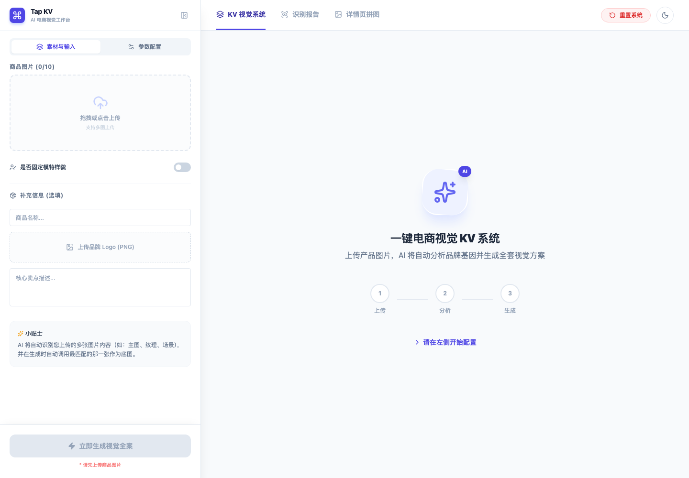
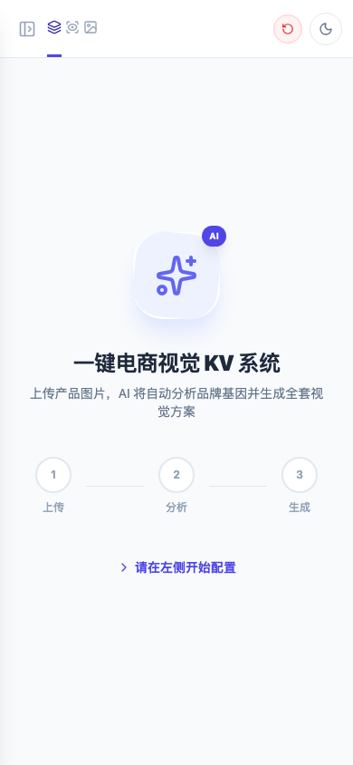

# Tap KV

Tap KV 是一款面向电商视觉创作的 AI 工作台。它可以根据商品素材自动分析品牌视觉基因，生成系列 KV 海报提示词、详情页结构与视觉执行方案，适合电商运营、设计师、品牌方和内容团队快速完成视觉方案的第一稿。

> 项目不内置、不保存、不上传你的 Gemini API Key。Key 只在当前浏览器页面内存中使用，刷新页面后会丢失。

## 在线体验

[打开 Tap KV](https://huybio9566.github.io/Tap-kv/)

如果你要输入真实 API Key，请务必确认页面地址使用 HTTPS。

## 功能亮点

- 多图商品素材识别：自动判断主图、材质、场景、证书、细节等素材角色。
- 品牌视觉分析：提取品牌名、产品类型、卖点、配色和风格方向。
- KV 视觉系统生成：输出系列海报创意描述、英文生成提示词、负面提示词和排版策略。
- 详情页拼图规划：辅助整理更适合电商落地的详情页结构。
- 自定义模型与代理：支持配置 Gemini 文本模型、图像模型、输出尺寸和可信 API Base URL。
- 响应式界面：桌面端适合完整工作流，移动端可快速查看和轻量操作。

## 截图

> 截图会随项目界面更新而迭代。





## 快速开始

准备环境：

- Node.js 20 或更高版本
- npm
- Gemini API Key

安装依赖：

```bash
npm ci
```

启动开发服务：

```bash
npm run dev
```

打开终端输出中的本地地址，通常是：

```text
http://localhost:3000
```

然后在页面左侧的「参数配置」中输入你的 Gemini API Key。

## 可用脚本

```bash
npm run dev        # 启动本地开发服务
npm run build      # 构建生产版本
npm run preview    # 预览生产构建
npm run typecheck  # TypeScript 类型检查
npm run check      # 类型检查 + 生产构建
```

## API Key 与安全说明

Tap KV 采用纯前端运行方式，因此 Gemini 请求会从你的浏览器发出。

- API Key 不会写入仓库、不进入构建产物、不保存到 localStorage。
- 刷新页面后需要重新输入 API Key。
- 如果你配置自定义 API Base URL，该代理服务会接收到你的 API Key。
- 自定义 API Base URL 默认要求 HTTPS，本地调试地址 `localhost` / `127.0.0.1` 例外。
- 不建议在 HTTP 页面输入真实 API Key。

如果你要把 Tap KV 部署给团队使用，更推荐增加一层后端代理，由服务端安全地持有 API Key，并增加鉴权、配额和日志脱敏。

## 部署

本仓库内置 GitHub Pages 工作流。合并到 `main` 后，GitHub Actions 会自动执行：

1. 安装依赖
2. 类型检查
3. 构建生产产物
4. 发布到 GitHub Pages

如果你使用自定义域名，请在 GitHub Pages 中开启 HTTPS，并确认 DNS 与证书状态正常。

## 技术栈

- React
- TypeScript
- Vite
- Tailwind CSS
- Gemini API
- GitHub Pages

## 贡献

欢迎提交 Issue 和 Pull Request。为了让讨论更高效，请尽量提供：

- 你的使用场景
- 复现步骤或截图
- 期望的输出效果
- 浏览器与系统版本

详见 [CONTRIBUTING.md](CONTRIBUTING.md)。

## 安全问题

如果你发现 API Key 泄露、代理滥用或其他安全风险，请先阅读 [SECURITY.md](SECURITY.md)。

## 许可证

[MIT](LICENSE)
